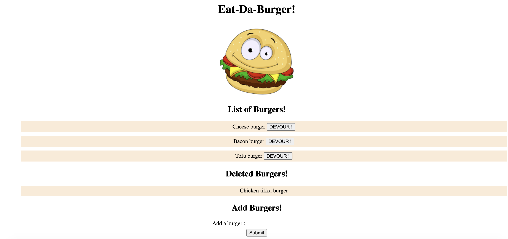

# Burger-app

## Description
A simple burger application used to add and delete burgers which is built using the MVC paradigm - Models,Views,Controllers.
This application is built using Express,Node.js,mysql,ORM and deployed through Heroku.

## Application screenshot

## Website URL
https://rocky-bayou-21194.herokuapp.com/

## Technologies used
Node
Express
Mysql database

## NPM packages used
express
express-handlebars
mysql
